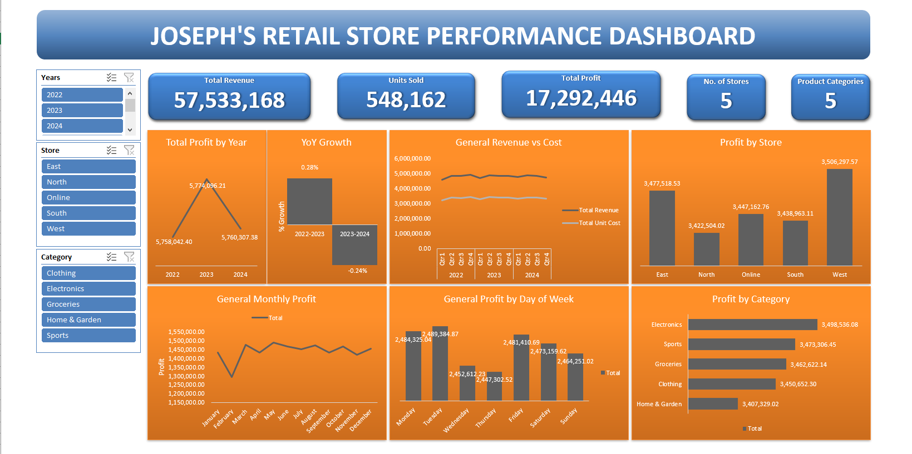

# retail-store-performance-data-analysis-Excel
Excel Project

# Company Sales Analysis and Dashboard Creation
## Table of Contents
1. [Overview](#overview)
2. Data Processing and Analysis
    - [Data Cleaning](#data-cleaning-and-standardization)
    - [Data Analysis](#data-analysis)
    - [Dashboard Buiding](#dashboard-building)
    - [Insights](#insights-gathered)


### Overview
In this project, I analyse a comany's performance for a 3-year period. The company has different branches, including an online one, and deals with a variety of product categories.

I go ahead and create a dashboard showing the general performance in terms of the company's revenue and cost of product production, profit over the years, trends in monthly purchases and also weekly performance.

### Data Cleaning and Standardization
#### Data Merging/Appending to one common sheet to work from
- I start first by merging the data in the 3 different sheets to one sheet so that I can now have one working sheet. 
    `Data > Get Data > Data Selection > Load (Queries and Connections) > Append(Three or more tables) > Data Selection > Close and Load > Successfully merged data is loaded to our working workbook`
- I create a copy of the sheet with merged data, so that the is a sheet to go back to incase the data get messed up while working on it.
#### Data Cleaning & Standardization
- I select the data and look for duplicates in the data and find none.
- I standardize the date column to show only the date, from `2022-01-01 00:00:00` to `01/01/2022` since the format provided before is not relevant for this analysis.
- I use Excel formulas to add the following three columns that are missing to help me achieve the data I need for analysis: `UnitCost, TotalUnitCost, Month Name`
    ```excel
    ([@Revenue]-([@Revenue] * [@MarginPct]))/[@QuantitySold]
    [@UnitCost]*[@QuantitySold]
    TEXT([@Date], "mmmm")
    ```
- I inspect the data by column to establish that the right data and data types have been provided.

After this I proceed to data analysis using pivot tables and also using excel formulas.

### Dashboard Analysis
- I use pivot tables tp establish the following:
    - Total Revenue, Total Unit Cost and Total Profit over the 
    
    - Total units sold, distinct stores and distinct product categories
    
    #### Advanced
    - Profit per Store,
    
    - Profit per Product Category
    
    - Profit by Month, Profit by Day
    
    
    - Revenue vs Product Cost, Quarterly every Year
    

I then proceed to create a dashboard using the above pivot table analysed data.

### Dashboard Building
- I create an interactive dashboard with filters such as the year, store and product category to help the end user navigate the data while gathering insights.
- I use bar charts, line charts and cards to visualize the data.

Below is a photo of the dashboard:


### Insights Gathered
1. 2022 led in terms of profit in the 3 years.
2. Even with the regular discounts on products, the total revenue has consistently stayed above the product cost of production in all quarters.
3. The leading store, by profit, is the store in the West in all the years combined.
4. The leading product categoryby profit, is Electronics in all the years combined.

More insights can be found in the dashboard included in the `Retail Analytics - Dash.xlsx` file.
